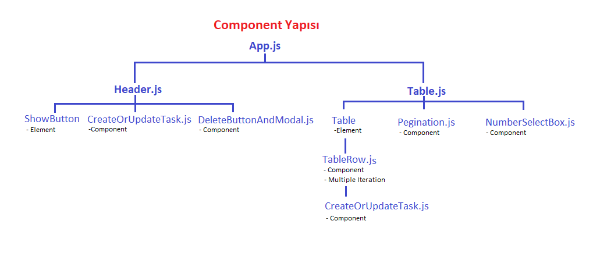

# Task App
## Ne Yapıldı: 
- Stillendirme için Bootstrap ve React-Bootstrap kullandım. 
- State management için Context API kullandım. Ama bir state sadece bir alttaki chield’a gidecekse bu state’i context API’de tutmadım, props olarak gönderdim. Context API’yi ardı ardına iki veya daha fazla component’a aktarılma (prop drilling) durumu olan state ve function’lar için kullandım. 
- API’den liste halinde bütün task’ları useEffect() ile ilk componendDidMount olduğunda çekiyorum. ‘Show Tasks’ button’una basınca zaten gelmiş olan veri gösteriliyor. 
- Kullanıcı tek seferde tabloda kaç satır olacağını belirleyebiliyor. Bu sayıya göre pegination yapılıyor. Kullanıcı tek seferde tabloda görünmesini istediği satır sayısını değiştirince, kaç tablo sayfası olduğu da değişiyor. Kullanıcı bu sayfalar arasında gezinebiliyor. 
- Tablo head’ının solunda bulunan check box’a tıklanınca bütün satırlar seçilmiş oluyor. 
- “Delete Task” butonu ancak bir veya birden fazla satır check yapılınca görülüyor. 
- Herhangi bir satırın check box’ına tıklandığında sağda “Update Task” yazan bir buton çıkıyor. Kullandıcı hangi satırda görünen “Update Task” butonuna tıklarsa o satırı update ediyor. 
- Update ve Create için aynı component’i kullandım. Ayrı ayrı kullansam bu component biraz daha kısa olurdu. Ama reusebility için iki operasyon için tek component kullandım. 
- Fake api olarak kullandığım mockapi.io task’i update ederken id’sini değiştirmeye izin vermiyor ve aynı şekilde yeni bir task oluşturuken id’yi bizim atamamıza izin vermiyor. Kendisi atıyor. Benden kaynaklamayan bu husus haricinde bütün isterleri karşıladığımı düşünüyorum. 

## Component Mimarisi
